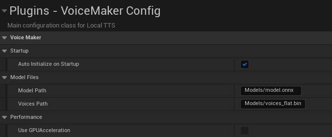
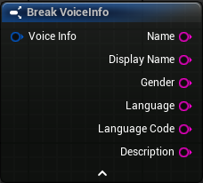
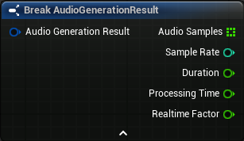
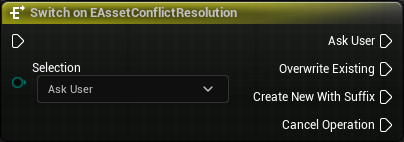

# API Reference

[← Back to README](README.md)

## Table of Contents
- [Config](#config)
- [Structs](#structs)
- [Enums](#enums)
- [Classes](#classes)

## Config

### Voice Maker Config

**C++ Class**: `UVoiceMakerConfig`

Main configuration class for the VoiceMaker plugin. This class extends UDeveloperSettings and provides project-wide settings for the TTS system.

You can change the VoiceMaker config by going to *Edit > Project settings... > Plugins > VoiceMaker config*.

To initialize the TTS system with these settings, use [Init](subsystem.md#init) or [Initialize VoiceMaker Subsystem](bp_library.md#initialize-voicemaker-subsystem).

| Name | Type | Default Value | Editor Visibility | Blueprint Visibility | Description |
|------|------|---------------|------------------|---------------------|-------------|
| bAutoInitializeOnStartup | `bool` | `true` | EditAnywhere | BlueprintReadOnly | If checked, the model path and voice will be automatically loaded by the subsystem at startup (editor and runtime) |
| ModelPath | `FString` | `"Models/model.onnx"` | EditAnywhere | BlueprintReadOnly | Path to the ONNX model file |
| VoicesPath | `FString` | `"Models/voices_flat.bin"` | EditAnywhere | BlueprintReadOnly | Path to the voices file |
| ~~bUseGPUAcceleration~~ | `bool` | `false` | VisibleAnywhere | BlueprintReadOnly | Whether to use GPU acceleration (not yet supported) |

## Structs

### Voice Info

**C++ Struct**: `FVoiceInfo`

Voice information structure containing detailed voice metadata. Used with nodes [Get Available Voices Info](subsystem.md#get-available-voices-info) and [Get Voice Information](subsystem.md#get-voice-information).

| Name | Type | Default Value | Editor Visibility | Blueprint Visibility | Description |
|------|------|---------------|------------------|---------------------|-------------|
| Name | `FString` | `""` | EditAnywhere | BlueprintReadWrite | Voice identifier name |
| DisplayName | `FString` | `""` | EditAnywhere | BlueprintReadWrite | Human-readable voice name |
| Gender | `FString` | `""` | EditAnywhere | BlueprintReadWrite | Voice gender (Male/Female) |
| Language | `FString` | `""` | EditAnywhere | BlueprintReadWrite | Voice language name |
| LanguageCode | `FString` | `""` | EditAnywhere | BlueprintReadWrite | Voice language code |
| Description | `FString` | `""` | EditAnywhere | BlueprintReadWrite | Voice description |

### Audio Generation Result

**C++ Struct**: `FAudioGenerationResult`

Result structure containing generated audio data and metadata. Used with node [Generate Audio Data](subsystem.md#generate-audio-data) through delegate [On Audio Data Generated Callback](subsystem.md#on-audio-data-generated-callback).

| Name | Type | Default Value | Editor Visibility | Blueprint Visibility | Description |
|------|------|---------------|------------------|---------------------|-------------|
| AudioSamples | `TArray<float>` | `{}` | EditAnywhere | BlueprintReadOnly | Generated audio samples |
| SampleRate | `int32` | `24000` | EditAnywhere | BlueprintReadOnly | Sample rate of the audio |
| Duration | `float` | `0.0f` | EditAnywhere | BlueprintReadOnly | Duration of the audio in seconds |
| ProcessingTime | `float` | `0.0f` | EditAnywhere | BlueprintReadOnly | Time taken to process the audio |
| RealtimeFactor | `float` | `0.0f` | EditAnywhere | BlueprintReadOnly | Real-time factor (Duration / ProcessingTime) |

## Enums

### Asset Conflict Resolution

**C++ Enum**: `EAssetConflictResolution`

***Editor only! Do not use at runtime***

Enumeration for handling asset conflicts when saving SoundWave assets. Used with node [Save Audio Data as SoundWave Asset](bp_library.md#save-audiodata-as-soundwave-asset).

| Name | Description |
|------|-------------|
| Ask *(default)* | When a SoundWave asset already exists, open a message dialog to ask the user what to do |
| Overwrite | When a SoundWave asset already exists, overwrite it |
| CreateNew | When a SoundWave asset already exists, change the asset name and add a suffix like _0, _1, ... to it |
| Cancel | When a SoundWave asset already exists, cancel the current save operation |

## Classes

The main classes are documented in separate pages:

- [VoiceMakerSubsystem](subsystem.md) - Core TTS subsystem
- [VoiceMakerBPLibrary](bp_library.md) - Blueprint function library
