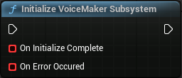
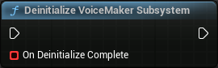

# VoiceMakerBPLibrary

[← Back to README](README.md) | [← Back to API Reference](api_reference.md)

## Table of Contents
- [Initialize VoiceMaker Subsystem](#initialize-voicemaker-subsystem)
- [Deinitialize VoiceMaker Subsystem](#deinitialize-voicemaker-subsystem)
- [Is VoiceMaker Subsystem Initialized](#is-voicemaker-subsystem-initialized)
- [Generate Audio Data](#generate-audio-data)
- [Audio Data to PCM Data](#audio-data-to-pcm-data)
- [Audio Data to WAV Data](#audio-data-to-wav-data)
- [Create SoundWave from AudioData](#create-soundwave-from-audiodata)
- [Save AudioData as SoundWave Asset](#save-audiodata-as-soundwave-asset)
- [Show save file selection dialog](#show-save-file-selection-dialog)

## Initialize VoiceMaker Subsystem

**C++ Function**: `static void UVoiceMakerBPLibrary::InitializeSubsystem(FOnInitializeComplete OnInitializeComplete, const FOnErrorOccured& OnErrorOccured)`

See [Init](subsystem.md#init) subsystem node.

## Deinitialize VoiceMaker Subsystem

**C++ Function**: `static void UVoiceMakerBPLibrary::DeinitializeSubsystem(FOnInitializeComplete OnDeinitializeComplete)`

See [Deinitialize](subsystem.md#deinitialize) subsystem node.

## Is VoiceMaker Subsystem Initialized

**C++ Function**: `static bool UVoiceMakerBPLibrary::IsSubsystemInitialized()`

See [Is Initialized](subsystem.md#is-initialized) subsystem node.

## Generate Audio Data

**C++ Function**: `static void GenerateAudioData(const FString& Text, const FString& VoiceName, float Speed, const FString& Language, FOnAudioDataGeneratedCallback OnComplete, const FOnErrorOccured& OnErrorOccured)`

This will internaly use the Subsystem node [Generate Audio Data](subsystem.md#generate-audio-data) to perform TTS. Please see [Generate Audio Data](subsystem.md#generate-audio-data) for more details.

## Audio Data to PCM Data

**C++ Function**: `static TArray<uint8> UVoiceMakerBPLibrary::ToPCMData(const FAudioGenerationResult& AudioData)`

Transform the Audio float data into audio PCM data (not WAV file data, use [Audio Data to WAV Data](#audio-data-to-wav-data) instead).

| Name | Type | Default Value | Description |
|------|------|---------------|-------------|
| AudioData | const [Audio Generation Result](api_reference.md#audio-generation-result)& | - | The generated [Audio Generation Result](api_reference.md#audio-generation-result) to convert to PCM data |

**Returns**: `TArray<uint8>` - The PCM data

## Audio Data to WAV Data

**C++ Function**: `static TArray<uint8> UVoiceMakerBPLibrary::ToWAVData(const FAudioGenerationResult& AudioData)`

Transform the Audio float data into a WAV format byte array. This includes the creation and addition of a WAV file header to the PCM audio data.

| Name | Type | Default Value | Description |
|------|------|---------------|-------------|
| AudioData | const [Audio Generation Result](api_reference.md#audio-generation-result)& | - | The generated [Audio Generation Result](api_reference.md#audio-generation-result) to convert to WAV data |

**Returns**: `TArray<uint8>` - The WAV data

## Create SoundWave from AudioData

**C++ Function**: `static USoundWaveProcedural* UVoiceMakerBPLibrary::CreateSoundWave(const FAudioGenerationResult& AudioData)`

Create a USoundWaveProcedural Object that can be used at runtime to play the audio.

| Name | Type | Default Value | Description |
|------|------|---------------|-------------|
| AudioData | const [Audio Generation Result](api_reference.md#audio-generation-result)& | - | The input [Audio Generation Result](api_reference.md#audio-generation-result) used to create and populate the Sound |

**Returns**: `USoundWaveProcedural*` - The created SoundWave, or `nullptr` if an error occurred

## Save AudioData as SoundWave Asset

**C++ Function**: `static FString UVoiceMakerEditorBPLibrary::SaveAsSoundWaveAsset(const FString& AssetPath, const FAudioGenerationResult& AudioData, EAssetConflictResolution ConflictResolution)`

**(Editor Only)** Saves the provided audio data as a SoundWave asset in the specified path within the Unreal Engine content browser.

| Name | Type | Default Value | Description |
|------|------|---------------|-------------|
| AssetPath | `const FString&` | - | The desired path for the asset to be saved. Must be a valid Unreal Engine asset path |
| AudioData | const [Audio Generation Result](api_reference.md#audio-generation-result)& | - | The generated [Audio Generation Result](api_reference.md#audio-generation-result) to be saved as a SoundWave asset |
| ConflictResolution | [Asset Conflict Resolution](api_reference.md#asset-conflict-resolution) | - | Specifies how to handle cases where an asset with the same name already exists at the target path |

**Returns**: `FString` - The final package name of the asset if saved successfully, or an empty string if the operation fails

## Show save file selection dialog

**C++ Function**: `static bool UVoiceMakerEditorBPLibrary::ShowFileSaveSelectionDialog(FString& SelectedPath)`

**(Editor Only)** Displays a save file selection dialog for the user to specify a location to save a new SoundWave asset within the Unreal Engine content browser.

| Name | Type | Default Value | Description |
|------|------|---------------|-------------|
| SelectedPath | `FString&` | - | A reference to a string that will be updated with the path selected by the user if the dialog succeeds |

**Returns**: `bool` - True if a valid save location was selected by the user, false otherwise
