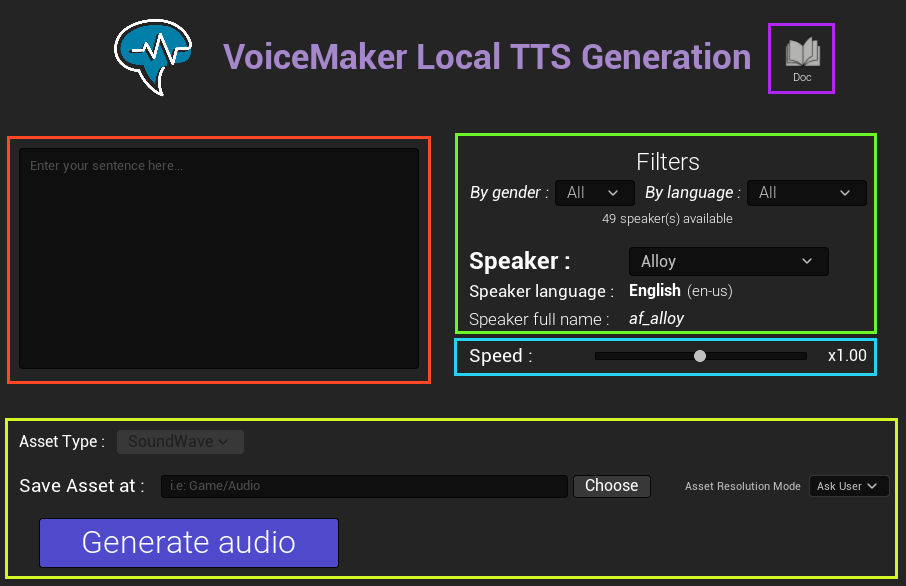
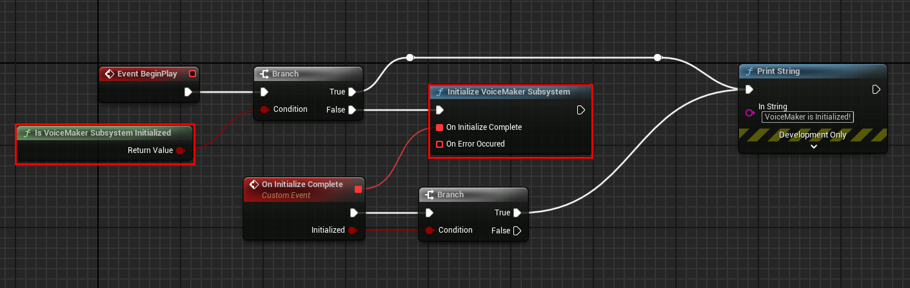

# Quickstart Guide

[← Back to README](README.md)

## Table of Contents
- [Installation](#installation)
- [Editor Usage](#editor-usage)
- [Runtime Usage](#runtime-usage)

## Installation

*This section will be completed with detailed installation instructions for the Fab and Epic Games launcher.*

### Prerequisites

* Unreal 5.0 or later
* Windows platform *(Linux and Mac support upcoming)*

### Installation Steps

### Verification

## Editor Usage

> [!TIP]
> The VoiceMaker Editor Window is used to pre-generate TTS SoundWave asset. You can then use them as any SounWave within your project!

Once you have installed and enabled the plugin, the VoiceMaker icon should appear on the top of the Editor. Click on it to open the VoiceMaker editor Window.

> [!NOTE]
> You can also open the VoiceMaker editor Window by going to the menu *Help > VoiceMaker*
> 

Here are some explanations about the editor window:

* On the  <b style="color: #FF4927">Red box</b>, enter the text used for the generation. We recommand to avoid short sentences (less than 5 words) or long sentences (more than 400 words).
* On the  <b style="color: #6CF527">Green box</b>, Select the speaker used for the generation. You can filter the speaker list by gender and/or language. Under the speaker dropdown is displayed the language and full name of the selected speaker, for information purpose. You can find a list of all available speakers [here](voices.md).
* On the  <b style="color: #27D3F5">Blue box</b>, Adjust the speed of the speech. The speed parameter directly influence the generation and not the audio speed, giving the impression of a fast or slow speech.
* On the  <b style="color: #D3F527">Yellow box</b>, Select the destination type and path. Currently, only SoundWave asset can be generated through the VoiceMaker editor Window, but you can use the Blueprint nodes to get the audio sample as PCM or WAV bytes. [More information](bp_library.md#audio-data-to-pcm-data). You can change the *Asset Resolution Mode* in case a file already exist at this location. 
* You can click the book icon on the  <b style="color: #B027F5">Purple box</b> to open this documentation.

> [!NOTE]
> The  <b style="color: #FF4927">Text parameter</b> does only handle latin alphabet yet. Other alphabets such as Japenese, Chinese, Hindi, Arabic, ... alphabets will be added in future updates. 

> [!NOTE]
> The  <b style="color: #27D3F5">Speed parameter</b> label right to the slider is not updated in UE 5.0-5.5. This is only a visual bug as the correct speed slider value will be used for the generation. It will be fixed with future update.

Once you have set up every parameter, click the ***Generate audio*** button. A new SoundWave Asset will be automatically saved at the destination location.

## Runtime Usage

### Demo level

The VoiceMaker plugin comes with a demo level. In order to open it, ensure that *Show Engine Content* and *Show Plugin Content* are checked in your Content Drawer Settings.

Then, navigate to `Engine > Plugins > VoiceMaker Content > Demo` and open **M_VoiceMakerDemo**.

The demo level does only contains one actor and one Widget Blueprint. Hit play to start playing with the demo level.

The demo level interface is the same as the [Editor Window](#editor-usage) listed above. When you click the ***Generate and Play*** button, the audio will be created and played at runtime. You cannot click the button again until the previous speech is done. Click the ***Exit*** button or stop the level to exit the demo level.

> [!TIP]
> Do not hesitate to open `BP_VoiceMakerDemo` Actor to see how VoiceMaker nodes are used in the demo level. When you click the button, the Widget Blueprint will call the Actor Event *Generate TTS* with the sentence, the speaker full name (i.e.: af_alloy), the speed and the language code (i.e.: en-us).

### Add VoiceMaker to your Blueprints

You can add VoiceMaker to any kind of Blueprints. However, the node  [Save AudioData as SoundWave Asset](bp_library.md#save-audiodata-as-soundwave-asset) is only available with Editor Utility Objects (such as EditorUtilityActor or EditorUtilityWidget). The example below use an Actor Blueprint.

Prior to using any VoiceMaker feature, we must ensure that the VoiceMaker subsystem is initialized. By default, the VoiceMaker subsystem is automatically initialized at the editor/game startup. Use the node [Is VoiceMaker Subsystem Initialized](bp_library.md#is-voicemaker-subsystem-initialized) to determine if VoiceMaker is initialized. If this is not the case, Use either the node [Initialize VoiceMaker Subsystem](bp_library#initialize-voicemaker-subsystem) or [Init (with Settings)](subsystem.md#init-with-settings) to initialize the VoiceMaker subsystem.

When VoiceMaker is initialized, you can use the node [Generate Audio Data](bp_library.md#generate-audio-data)