# VoiceMakerSubsystem

[← Back to README](README.md) | [← Back to API Reference](api_reference.md)

## Table of Contents
- [Get Voice Maker Subsystem](#get-voice-maker-subsystem)
- [Init](#init)
- [Init (with settings)](#init-with-settings)
- [Deinitialize](#deinitialize)
- [Is Initialized](#is-initialized)
- [Generate Audio Data](#generate-audio-data)
- [Get Available Voices](#get-available-voices)
- [Get Available Voices Info](#get-available-voices-info)
- [Is Voice Available](#is-voice-available)
- [Get Voice Information](#get-voice-information)
- [On Subsystem Error Occured](#on-subsystem-error-occured)
- [On Subsystem Status Changed](#on-subsystem-status-changed)
- [On Initialize Complete](#on-initialize-complete)
- [On Audio Data Generated Callback](#on-audio-data-generated-callback)
- [On Error Occured](#on-error-occured)

 

## Get Voice Maker Subsystem

**C++ Code**: `GEngine->GetEngineSubsystem<UVoiceMakerSubsystem>()`

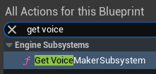
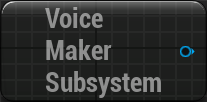

Get the VoiceMaker TTS Engine Subsystem

 

## Init

**C++ Function**: `void UVoiceMakerSubsystem::InitializeLocalTTS(FOnInitializeComplete OnInitializeComplete, const FOnErrorOccured& OnErrorOccured)`

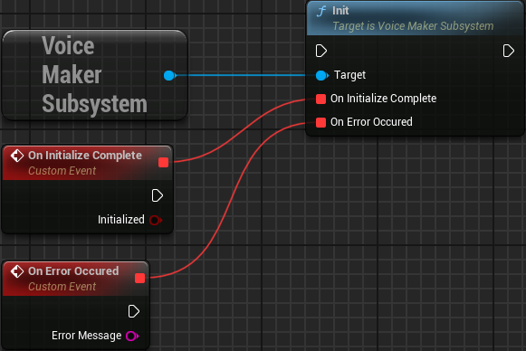

Initialize the Local TTS engine with [project settings](api_reference.md#config) configuration.

> [!NOTE]
> Does nothing if the Subsystem is already initialized.

| Name | Type | Default Value | Description |
|------|------|---------------|-------------|
| OnInitializeComplete | [On Initialize Complete](#on-initialize-complete) | - | Called with `initialized=true` after the initialization is done |
| OnErrorOccured | const [On Error Occured](#on-error-occured)& | - | Called with `initialized=false` when the initialization failed |

 

## Init (with settings)

**C++ Function**: `void UVoiceMakerSubsystem::InitializeLocalTTSWithSettings(const FString& ModelPath, const FString& VoicesPath, bool bUseGPU, FOnInitializeComplete OnInitializeComplete, const FOnErrorOccured& OnErrorOccured)`

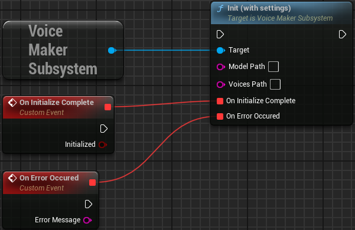

Initialize the Local TTS engine with custom model files. This function loads the ONNX model and voice embeddings required for TTS generation.

> [!NOTE]
> Does nothing if the Subsystem is already initialized.

| Name | Type | Default Value | Description |
|------|------|---------------|-------------|
| ModelPath | `const FString&` | - | Path to the ONNX model file. Leave blank to use config model path |
| VoicesPath | `const FString&` | - | Path to the voices binary file. Leave blank to use config voice path |
| ~~bUseGPU~~ | `bool` | `false` | Whether to enable GPU acceleration (requires CUDA-compatible hardware) **(not supported yet)** |
| OnInitializeComplete | [On Initialize Complete](#on-initialize-complete) | - | Called with `initialized=true` after the initialization is done |
| OnErrorOccured | const [On Error Occured](#on-error-occured)& | - | Called with `initialized=false` when the initialization failed |

 

## Deinitialize

**C++ Function**: `void UVoiceMakerSubsystem::DeinitializeLocalTTS(FOnInitializeComplete OnDeinitializeComplete)`

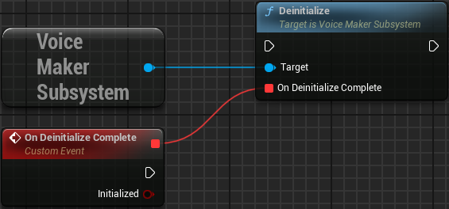

Deinitialize the Local TTS engine.

> [!NOTE]
> Does nothing if the Subsystem is already deinitialized.

| Name | Type | Default Value | Description |
|------|------|---------------|-------------|
| OnDeinitializeComplete | [On Initialize Complete](#on-initialize-complete) | - | Called with `initialized=false` after the deinitialization is done |

 

## Is Initialized

**C++ Function**: `bool UVoiceMakerSubsystem::IsInitialized() const`

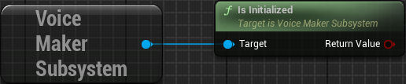

Check if the TTS system is initialized and ready for audio generation.

**👉 Returns**: `bool` - True if the system is initialized and ready to generate audio

 

## Generate Audio Data

**C++ Function**: `void UVoiceMakerSubsystem::GenerateAudioData(const FString& Text, const FString& VoiceName, float Speed, const FString& Language, FOnAudioDataGeneratedCallback OnComplete, const FOnErrorOccured& OnErrorOccured)`

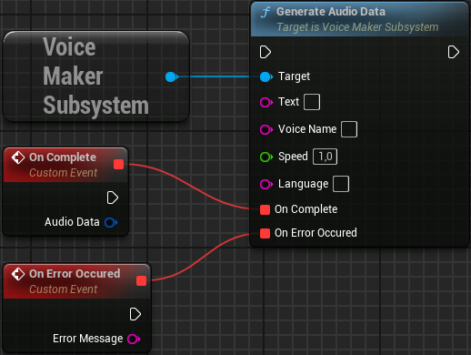

Generate audio data from text asynchronously. You can then use the following nodes with the [Audio Data](api_reference.md#audio-generation-result):
* [Audio Data to PCM Data](bp_library.md#audio-data-to-pcm-data)
* [Audio Data to WAV Data](bp_library.md#audio-data-to-wav-data)
* [Create SoundWave from AudioData](bp_library.md#create-soundwave-from-audiodata)
* [Save AudioData as SoundWave Asset](bp_library.md#save-audiodata-as-soundwave-asset) *(editor only)*

| Name | Type | Default Value | Description |
|------|------|---------------|-------------|
| Text | `const FString&` | - | The text to convert to speech |
| VoiceName | `const FString&` | - | Voice identifier. This **must** be the voice full name, i.e.: `af_alloy`. Empty = default voice. See [available voices](voices.md) |
| Speed | `float` | `1.0f` | Speech speed multiplier (0.5-2.0) |
| Language | `const FString&` | - | Language code, i.e.: `en_us`. Empty = default language |
| OnComplete | [On Audio Data Generated Callback](#on-audio-data-generated-callback) | - | Callback executed when generation succeeds, with the generated [Audio Generation Result](api_reference.md#audio-generation-result) |
| OnErrorOccured | const [On Error Occured](#on-error-occured)& | - | Callback executed when there was a generation error |

 

## Get Available Voices

**C++ Function**: `TArray<FString> UVoiceMakerSubsystem::GetAvailableVoices() const`

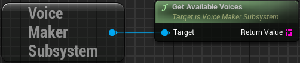

Get all available voice identifiers. Returns a list of all voice names that can be used with the generation functions.

> [!CAUTION]
> This will return an empty array if the Subsystem is not initialized.

**👉 Returns**: `TArray<FString>` - Array of voice identifiers, i.e.: ["af_sarah", "am_adam", "bf_emma"]

 

## Get Available Voices Info

**C++ Function**: `TArray<FVoiceInfo> UVoiceMakerSubsystem::GetAvailableVoicesInfo() const`

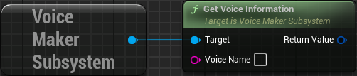

Get detailed information about all available voices. Provides [structured information](api_reference.md#voice-info) about each voice including display names, gender, language, and descriptions.

> [!CAUTION]
> This will return an empty array if the Subsystem is not initialized.

**👉 Returns**: `TArray<FVoiceInfo>` - Array of [Voice Info](api_reference.md#voice-info) structures

 

## Is Voice Available

**C++ Function**: `bool UVoiceMakerSubsystem::IsVoiceAvailable(const FString& VoiceName) const`

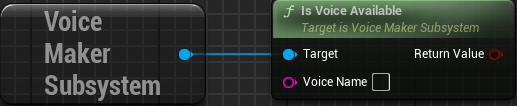

Check if a specific voice is available. Use this to validate voice names before generation to avoid errors.

| Name | Type | Default Value | Description |
|------|------|---------------|-------------|
| VoiceName | `const FString&` | - | Voice identifier to check |

**👉 Returns**: `bool` - True if the voice is available for use

 

## Get Voice Information

**C++ Function**: `FVoiceInfo UVoiceMakerSubsystem::GetVoiceInformation(const FString& VoiceName) const`

Get detailed information about a specific voice. Retrieves structured information about a specific voice by its identifier.

> [!CAUTION]
> This will return an empty voice if the Subsystem is not initialized.

| Name | Type | Default Value | Description |
|------|------|---------------|-------------|
| VoiceName | `const FString&` | - | Voice identifier to query |

**👉 Returns**: [Voice Info](api_reference.md#voice-info) - `FVoiceInfo` structure containing voice details, or empty if not found

 

## Delegates

### On Subsystem Error Occured

**C++ Delegate**: `FOnSubsystemErrorOccured UVoiceMakerSubsystem::OnSubsystemErrorOccured`

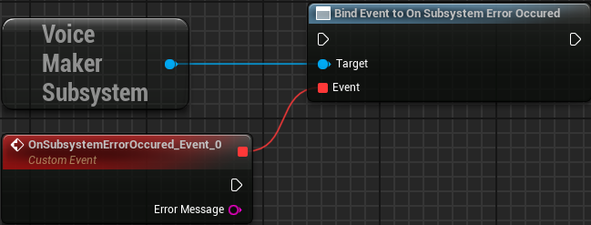

Delegate called every time an error occurred on the subsystem.

| Name | Type | Description |
|------|------|-------------|
| ErrorMessage | `const FString&` | The error message describing what went wrong |

 

### On Subsystem Status Changed

**C++ Delegate**: `FOnSubsystemStatusChanged UVoiceMakerSubsystem::OnSubsystemStatusChanged`

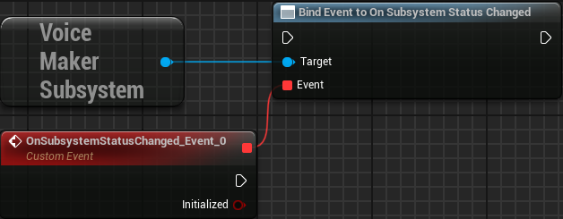

Delegate called every time the subsystem is initialized or deinitialized.

| Name | Type | Description |
|------|------|-------------|
| bInitialized | `bool` | True if the subsystem was initialized, false if deinitialized |

 

### On Initialize Complete

**C++ Delegate**: `FOnInitializeComplete`

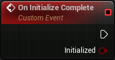

Dynamic delegate called when initialization or deinitialization completes. Used with nodes [Init](#init), [Init (with settings)](#init-with-settings) and [Deinitialize](#deinitialize).

| Name | Type | Description |
|------|------|-------------|
| bInitialized | `bool` | True if initialization succeeded, false if it failed or was deinitialized |

 

### On Audio Data Generated Callback

**C++ Delegate**: `FOnAudioDataGeneratedCallback`

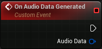

Dynamic delegate called when audio generation completes successfully. Used with node [Generate Audio Data](#generate-audio-data).

| Name | Type | Description |
|------|------|-------------|
| AudioData | [Audio Generation Result](api_reference.md#audio-generation-result) | The generated FAudioGenerationResult containing audio samples and metadata |

 

### On Error Occured

**C++ Delegate**: `FOnErrorOccured`

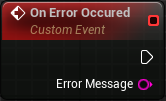

Dynamic delegate called when an error occurs during TTS operations. Used with nodes [Init](#init), [Init (with settings)](#init-with-settings) and [Generate Audio Data](#generate-audio-data).

| Name | Type | Description |
|------|------|-------------|
| ErrorMessage | `const FString&` | The error message describing what went wrong |
